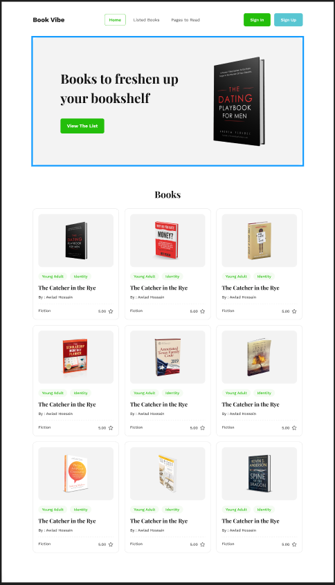
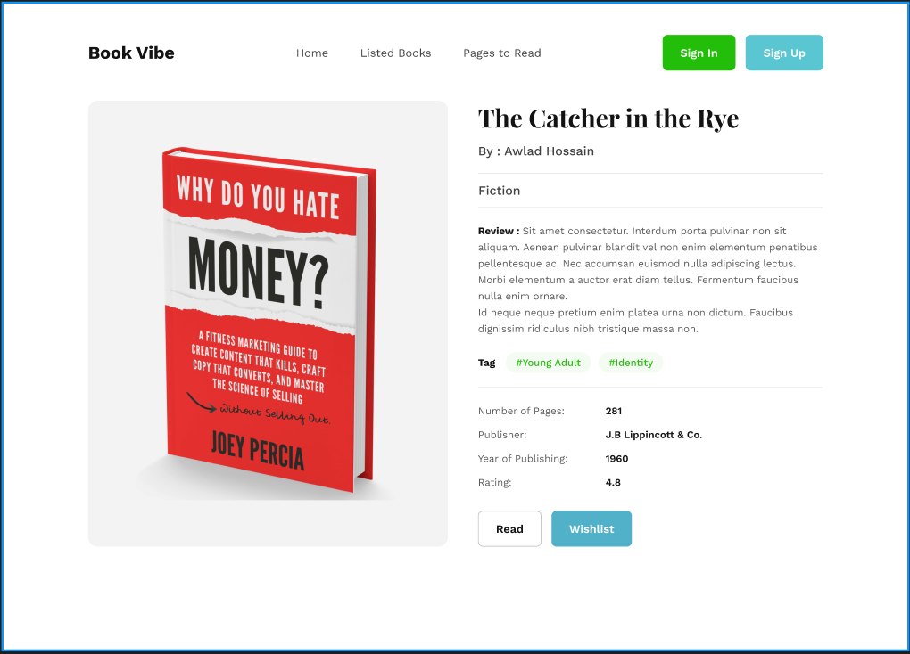
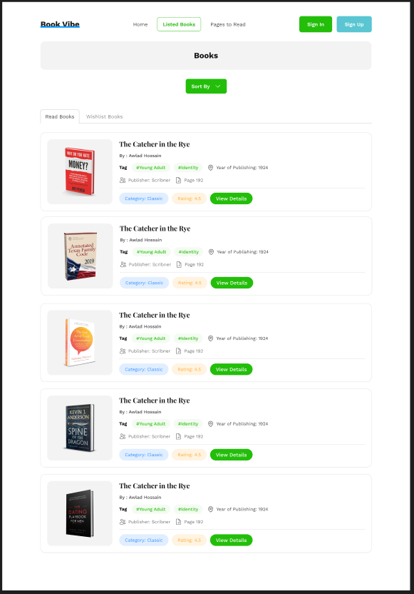

# Book Vibe

Book Vibe is a simple book listing website where users can browse books, check their ratings, and save books to a wishlist. The project is built using React, React Router, Tailwind CSS, and DaisyUI.

## Features
- Browse and view book listings
- Check book ratings
- Add books to a wishlist
- Responsive design

## Tech Stack
- **React** - Frontend framework
- **React Router** - For navigation and routing
- **Tailwind CSS** - For styling
- **DaisyUI** - Pre-styled UI components

## Installation

1. Clone the repository:
   ```sh
   git clone https://github.com/your-username/book-vibe.git
   ```
2. Navigate to the project directory:
   ```sh
   cd book-vibe
   ```
3. Install dependencies:
   ```sh
   npm install
   ```
4. Start the development server:
   ```sh
   npm run dev
   ```

## Screenshots

### Homepage


### Book Details Page


### Profile Page



## License
@Anowarul Asif (Immortal)
